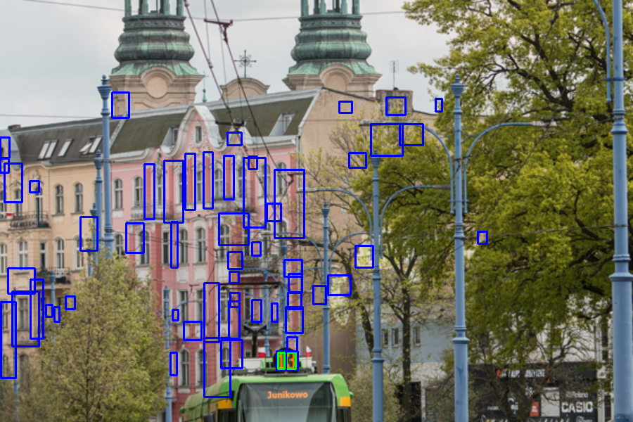

# Rozpoznawanie numerów tramwajów
Anna Panfil

## Wstęp
Program rozpoznaje numery tramwajów jeżdżących po Poznaniu. Na zdjęciu musi być widoczny front pojazdu z widocznym numerem (pojazd nie musi być na wprost patrzącego). Najlepiej, by zdjęcie było zrobione poziomo, w proporcjach 3:2 oraz dość dobrych warunkach oświetleniowych (nie w nocy).

## Charakterystyka problemu
Na zdjęciu należało odszukać cyfry w kolorze pomarańczowym, znajdujące się w szarych kołach nad dużym obiektem.

## Rozwiązanie
### Przetwarzanie całego zdjęcia
Na podstawie nasycenia tworzone jest zdjęcie w odcieniach szarości. Następnie poddawane jest ono segmentacji Watersheda.
Aby wyeliminować obiekty w nieodpowiednim kolorze, stosowane są dwie maski. Tworzona na podstawie czerwieni odfiltrowuje większość. Niebieska jest pomocnicza i służy do pozbycia się koloru białego.
Następnie eliminowany jest szum – za małe obiekty – oraz zbyt duże obiekty, będące najczęściej żółtymi częściami tramwaju.

Na tak otrzymanym zdjęciu wykrywane są kontury poszczególnych obiektów.

#### Przetwarzanie wykrytych obiektów
Na tym etapie następuje sprawdzenie, czy dany obiekt może być cyfrą. Dookoła każdego konturu tworzone są bounding boxy. Odrzucane są obiekty bardzo wąskie oraz poziome. Następnie bounding boxy są poszerzane, i sprawdzane jest tło za obiektem. Zostawiane są tylko te, których tło jest szare.

<!--  -->

Ostatnim etapem jest rozpoznanie cyfry na otrzymanym fragmencie zdjęcia. Do tego celu użyto silnika OCR o otwartym kodzie źródłowym – [Tesseract](https://github.com/tesseract-ocr/tesseract), ustawionego tak, by wykrywał jedynie pojedyncze cyfry lu znak 'X'.

Otrzymane cyfry są następnie sprawdzane pod kątem poprawności (numery tramwajów zwykle są mniejsze od 18, a w szczególnych przypadkach < 99 lub równe 'X').

## Wyniki
Ze strony [fotozajezdnia.pl](https://fotozajezdnia.pl/categories.php?cat_id=465) pozyskano 102 zdjęcia tramwajów. Są to głównie pojazdy Moderus Gamma, Moderus Beta, Tramino s150p, Tatra RT6N1 oraz wagony 105N. Zdjęcia są wykonane w różych warunkach oświetleniowych, różnymi aparatami, w różnych miejscach Poznania, z różną rozdzielczością i mają różne wymiary. Na zdjęciach znajdowało się 161 cyfr wchodzących w skład numeru tramwaju oraz jeden znak 'X'.

Algorytm rozpoznał poprawnie 122 czyli 75,31% cyfr. Na ich podstawie **poprawnie rozpoznał 54 czyli 52,94% numerów tramwajów.** 33 obiekty zostały błędnie uznane za cyfry (fałszywie pozytywne), natomiast 40 cyfr nie zostało rozpoznanych (fałszywnie negatywne). Zatem precyzję algorytmu (w rozpoznawaniu cyfr, a nie liczb) można określić na 78,71%, a jego pełność na 75,31%.
Poprawne wyniki można zobaczyć w [repozytorium](https://github.com/panka134/trams_number_detection/graphics/results.png)

### Analiza
Pomyłki przy zdjęciach w nocy wynikały ze zbytniego rozmycia konturów cyfr (11_05).
Przeszkadzała też zbytnia zmiana perspektywy (16_12) oraz niedostateczny kontrast między numerem a tłem (16_21). Na zdjęciu 16_21 widać też błędne rozpoznanie numeru peronu jako numeru tramwaju.
Zdarzało się również, że Tesseract błędnie rozpoznawał (lub nie rozpoznawał) cyfry na zdjęciach (np. na zdjęciu 12_04 rozpoznał '1' zamiast '2')

Dużą poprawę rezultatów daje sprawdzanie tła, na którym znajduje się potencjalna liczba. Na poniższym zdjęciu niebiekimi kwadratami są zaznaczone wszystkie wcześniej wykryte obiekty, a zielonym – te po określeniu koloru tła (13_01)

Na tym zdjęciu z kolei widzimy niepoprawnie poprawne wykrycie

